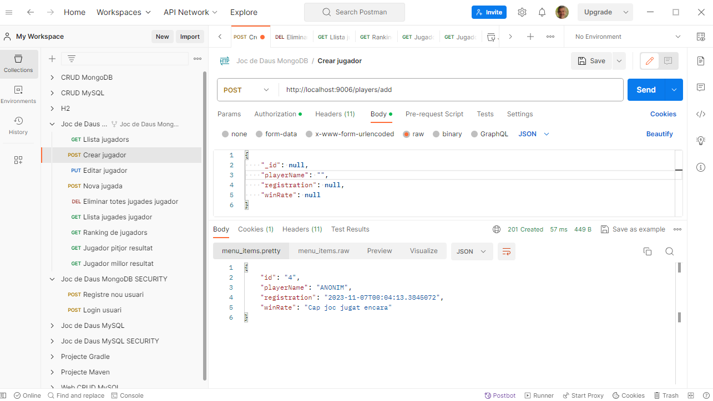
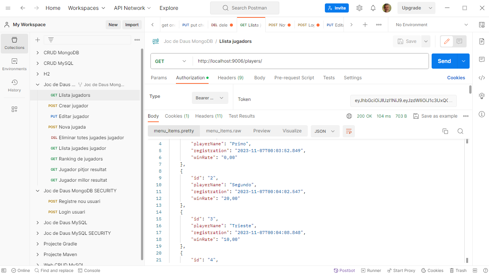
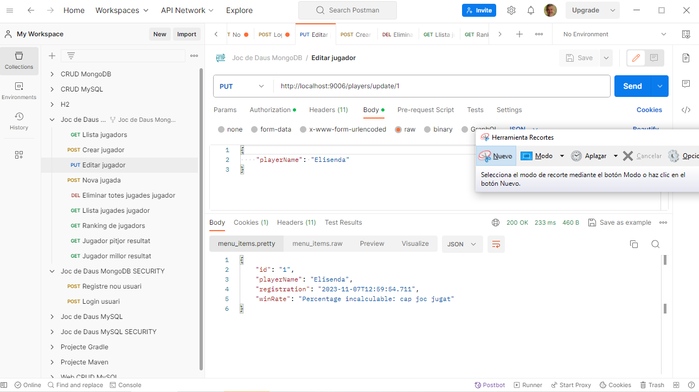
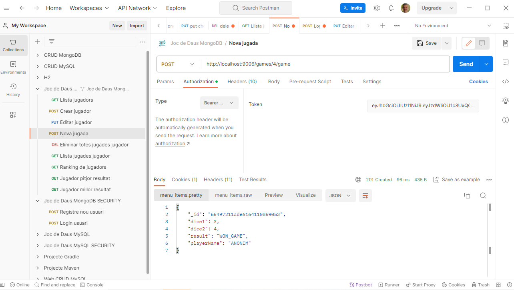
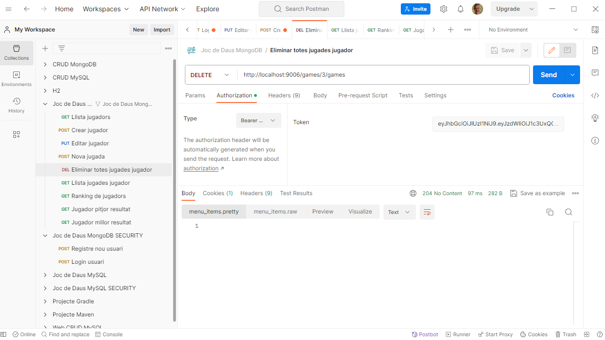
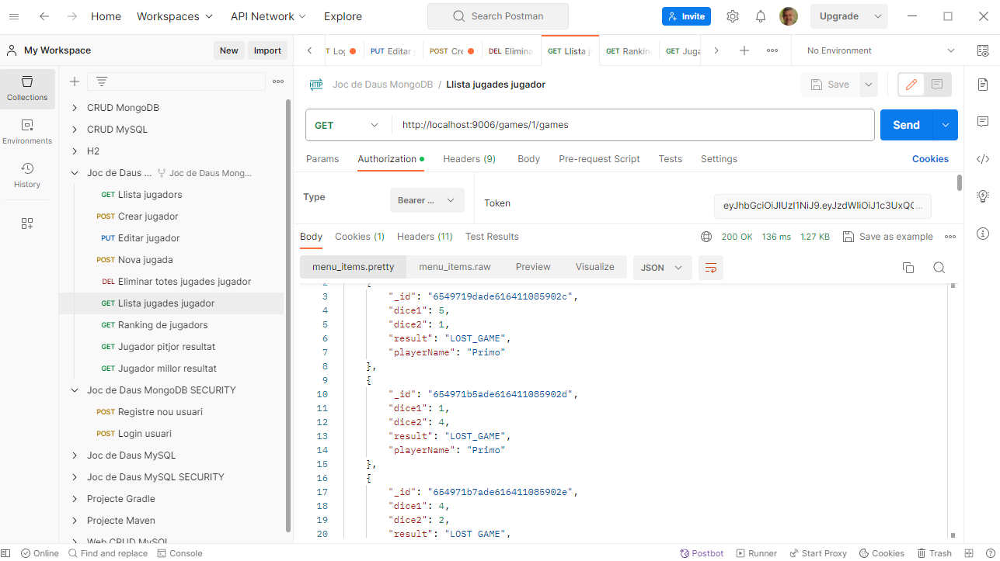
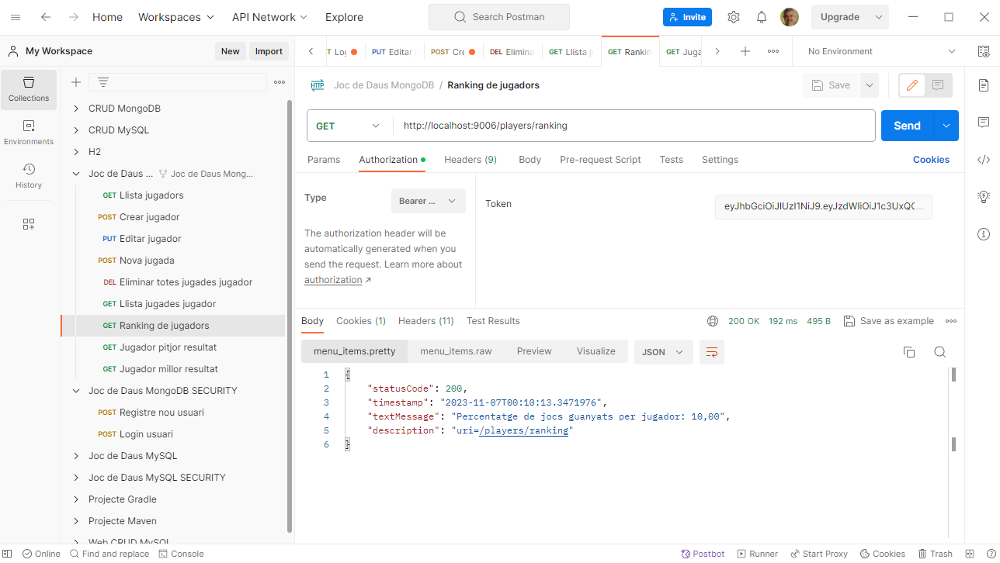
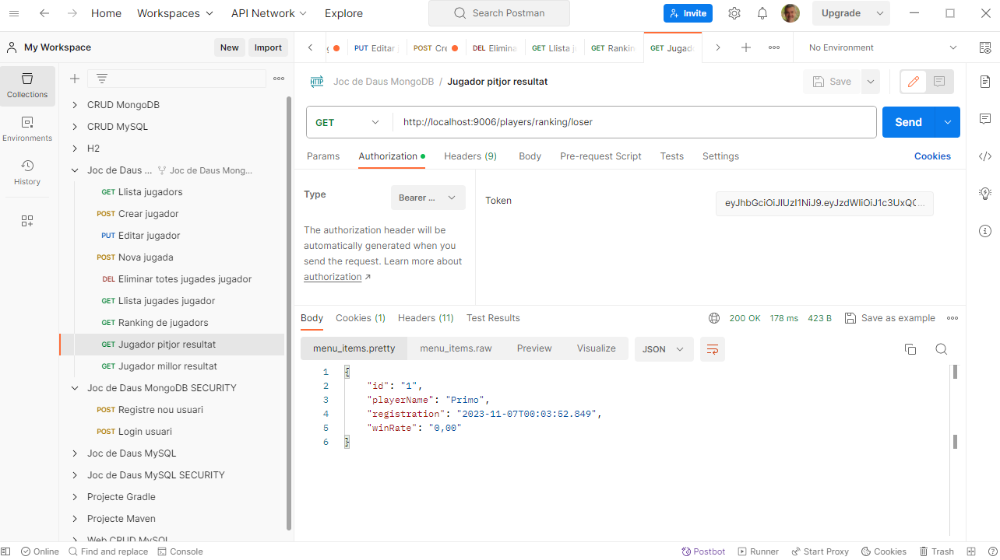
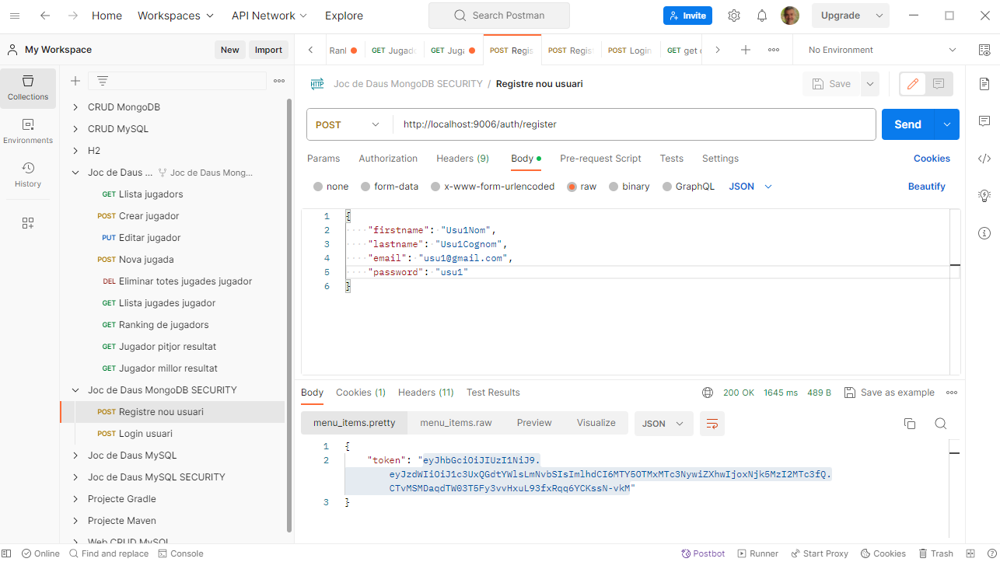
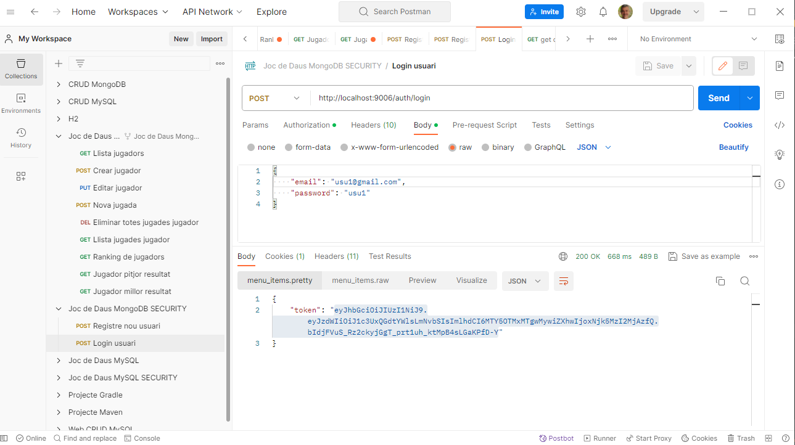

# Joc de Daus
## Sprint 5 | Tasca 02 | Nivell 1 | Fases 2 i 3
## MongoDB + JWT

### Postman:

#### Crear jugador:

#### Llista de jugadors:

#### Editar jugador:

#### Fer una jugada:

#### Eliminar les jugades d'un jugador:

#### Llista de jugadors amb resultats:

#### Llista de jugades d'un jugador:

#### Promig de jocs guanyats:

#### Jugador amb pitjor resultat promig:

#### Jugador amb millor resultat promig:

## SEGURETAT
### Registre d'un nou usuari:

### Login d'un usuari, amb email i password:

