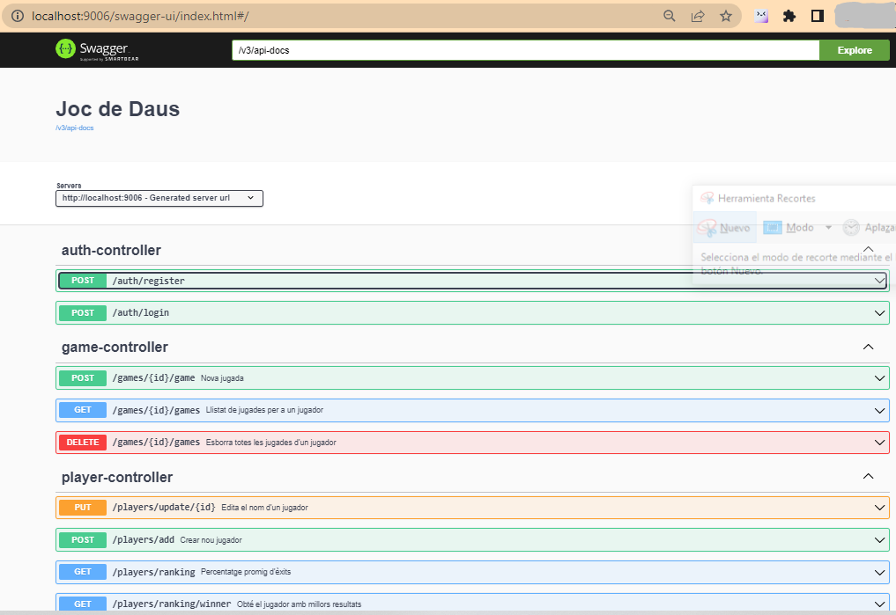

# Read Me First
The following was discovered as part of building this project:

* The original package name 'cat.itacademy.s5.02.n1.02.JocDeDausMongoDB' is invalid and this project uses 'cat.itacademy.s52.n12.JocDeDausMongoDB' instead.

# Getting Started

### Reference Documentation
For further reference, please consider the following sections:

* [Official Apache Maven documentation](https://maven.apache.org/guides/index.html)
* [Spring Boot Maven Plugin Reference Guide](https://docs.spring.io/spring-boot/docs/3.1.5/maven-plugin/reference/html/)
* [Create an OCI image](https://docs.spring.io/spring-boot/docs/3.1.5/maven-plugin/reference/html/#build-image)
* [Spring Web](https://docs.spring.io/spring-boot/docs/3.1.5/reference/htmlsingle/index.html#web)
* [Spring Data JPA](https://docs.spring.io/spring-boot/docs/3.1.5/reference/htmlsingle/index.html#data.sql.jpa-and-spring-data)
* [Spring Boot DevTools](https://docs.spring.io/spring-boot/docs/3.1.5/reference/htmlsingle/index.html#using.devtools)
* [Spring Data MongoDB](https://docs.spring.io/spring-boot/docs/3.1.5/reference/htmlsingle/index.html#data.nosql.mongodb)

### Guides
The following guides illustrate how to use some features concretely:

* [Building a RESTful Web Service](https://spring.io/guides/gs/rest-service/)
* [Serving Web Content with Spring MVC](https://spring.io/guides/gs/serving-web-content/)
* [Building REST services with Spring](https://spring.io/guides/tutorials/rest/)
* [Accessing Data with JPA](https://spring.io/guides/gs/accessing-data-jpa/)
* [Accessing Data with MongoDB](https://spring.io/guides/gs/accessing-data-mongodb/)

### SWAGGER API Documentation
* [/swagger-ui/index.html](http://localhost:9006/swagger-ui/index.html)
* 
