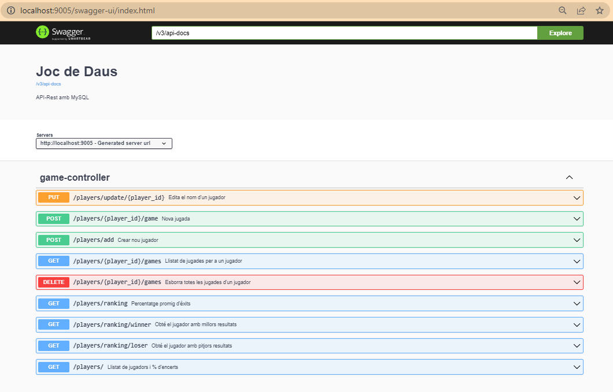

# Sprint 5 | Tasca 02 | Nivell 1

S5.02.N1   -   Fases 1 i 3

* Nom original del package 'cat.itacademy.s5.02.n1.01.JocDeDausMySQL' invàlid canviat per: 'cat.itacademy.s52.n11.JocDeDausMySQL'.

# [Enunciat:](https://itacademy.barcelonactiva.cat/mod/assign/view.php?id=4000)

El joc de daus s’hi juga amb dos daus. En cas que el resultat de la suma dels dos daus sigui 7, la partida és guanyada sinó, és perduda. Un jugador/a pot  veure un llistat de totes les tirades que ha fet i el percentatge d’èxit.

Per poder jugar al joc i realitzar una tirada, un usuari/ària  s’ha de registrar amb un nom no repetit. En crear-se, se li assigna un identificador numèric únic i una data de registre. Si l’usuari/ària així ho desitja, pot no afegir cap nom i es  dirà “ANÒNIM”. Pot haver-hi més d’un jugador “ANÒNIM”.

Cada jugador/a pot veure un llistat de totes les  tirades que ha fet, amb el valor de cada dau i si s’ha  guanyat o no la partida. A més, pot saber el seu percentatge d’èxit per totes les tirades  que ha fet.

No es pot eliminar una partida en concret, però sí que es pot eliminar tot el llistat de tirades per un jugador/a.

El software ha de permetre llistar tots els jugadors/es que hi ha al sistema, el percentatge d’èxit de cada jugador/a i el  percentatge d’èxit mitjà de tots els jugadors/es en el sistema.

El software ha de respectar els principals patrons de  disseny.

**NOTES**

Has de tindre en compte els  següents detalls de  construcció:

- URL’s:

        - POST /players -> crea un jugador/a. 

        - PUT /players -> modifica el nom del jugador/a.

        - POST /players/{id}/games/ -> un jugador/a específic realitza una tirada dels daus.  

        - DELETE /players/{id}/games -> elimina les tirades del jugador/a.

        - GET /players/ -> retorna el llistat de tots  els jugadors/es del sistema amb el seu  percentatge mitjà d’èxits.

        - GET /players/{id}/games -> retorna el llistat de jugades per un jugador/a.  

        - GET /players/ranking -> retorna el ranking mig de tots els jugadors/es del sistema. És a dir, el  percentatge mitjà d’èxits. 

        - GET /players/ranking/loser -> retorna el jugador/a  amb pitjor percentatge d’èxit.  

        - GET /players/ranking/winner -> retorna el  jugador amb pitjor percentatge d’èxit. 

- **Fase 1:**

  Persistència: utilitza com a base de dades MySQL.

- **Fase 2:**

  Canvia tot el que necessitis i utilitza MongoDB per persistir les dades.

- **Fase 3:**

  Afegeix seguretat: inclou autenticació per JWT en tots els accessos a les URL's del microservei.

### [SWAGGER](http://localhost:9005/swagger-ui/index.html)

### Documentació de referència
Seccions:

* [Official Apache Maven documentation](https://maven.apache.org/guides/index.html)
* [Spring Boot Maven Plugin Reference Guide](https://docs.spring.io/spring-boot/docs/3.1.5/maven-plugin/reference/html/)
* [Create an OCI image](https://docs.spring.io/spring-boot/docs/3.1.5/maven-plugin/reference/html/#build-image)
* [Spring Web](https://docs.spring.io/spring-boot/docs/3.1.5/reference/htmlsingle/index.html#web)
* [Spring Data JPA](https://docs.spring.io/spring-boot/docs/3.1.5/reference/htmlsingle/index.html#data.sql.jpa-and-spring-data)
* [Spring Boot DevTools](https://docs.spring.io/spring-boot/docs/3.1.5/reference/htmlsingle/index.html#using.devtools)

### Guies
Per saber com utilitzar algunes de les característiques:

* [Building a RESTful Web Service](https://spring.io/guides/gs/rest-service/)
* [Serving Web Content with Spring MVC](https://spring.io/guides/gs/serving-web-content/)
* [Building REST services with Spring](https://spring.io/guides/tutorials/rest/)
* [Accessing Data with JPA](https://spring.io/guides/gs/accessing-data-jpa/)
* [Accessing data with MySQL](https://spring.io/guides/gs/accessing-data-mysql/)

